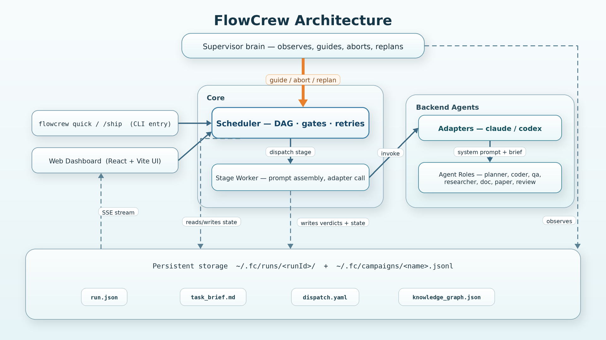

<p align="center">
  
</p>

# FlowCrew

<p align="center"><strong>Give your AI agent a team.</strong></p>
<p align="center"><em>Multi-agent orchestration for Claude Code and Codex — plan, execute, review, and recover autonomously.</em></p>

<p align="center">
  <a href="LICENSE"></a>
  = 22.5" />
  
  
</p>

---

**Ship a task in 3 seconds:**
```bash
flowcrew quick "refactor auth module into microservices with full test coverage"
```

**Or directly from your Claude Code / Codex session:**
```
> Let's split the auth module into token-validation and session-management...
> [discuss naturally]
> /ship
```

FlowCrew takes your intent, creates a team of specialized agents (planner, coder, QA, researcher), and drives the work to completion — with automatic retries, QA gates, and an AI supervisor that steers when things go off-track.

<p align="center">
  
</p>

---

## Why FlowCrew?

| Without FlowCrew | With FlowCrew |
|---|---|
| **You babysit each step** — monitor, intervene, restart when things break | **You ship a brief, check back when ready** |
| QA fails → debug + retry by hand | QA fails → coder fixes → QA re-checks, all automatic |
| Context dies between chat sessions | Run Memory Graph persists decisions, findings, dead ends |
| Black-box progress | Live dashboard + supervisor progress briefs |
| Each run starts from scratch | Campaigns link related runs; pivots informed by history |

## How it works

<p align="center">
  
</p>

## Experience at a glance

| 💬 Discuss → Plan | 📺 Live monitor | 🔁 Auto-recover | 🧠 Persist memory |
|---|---|---|---|
| Talk through intent; planner produces an inspectable DAG. | Stage status, terminal output, alerts streaming in real time. | QA fails → coder fixes → QA re-checks (up to 3×), then re-plans. | Findings, decisions, dead ends survive past the run. |

## ✨ Features

**Get started in seconds**
- 🚀 `/ship` from Claude Code or Codex — no context switch, no copy-paste
- ⚡ `flowcrew quick "task"` — CLI-first, live progress in terminal
- 📊 Browser dashboard for full visibility when you want it

**Execution that actually completes**
- 🤖 10 specialized agent roles — planner, coder, QA, researcher, writers, reviewers
- 🔁 QA gates catch issues → coder fixes → QA re-checks (automatic retry loop)
- 🧠 Supervisor brain monitors execution, detects stuck stages, steers toward goal
- 🔄 Re-planning when fixes fail — changes strategy instead of repeating the same mistake

**Memory that persists**
- 🧠 Run Memory Graph — findings, decisions, dead ends, evidence survive across iterations
- 🧬 Campaign Memory — score history, plateau detection, pivot signals across related runs
- 📁 Global run storage (`~/.fc/runs/`) — all projects in one place, one dashboard sees everything
- 📝 Auto-generated run summaries — what was done, files changed, key decisions, risks
- 📁 Full traceability — export any run as JSON, inspect stage outputs, verdicts, artifacts

**Built for teams**
- 🔌 Works with Codex and Claude (auto-detected, per-stage config isolation)
- 🛡️ Domain skills — inject project-specific conventions via Markdown files
- 💬 Interactive discussion before execution — scope the task, then let agents work

## 🧬 Campaign Intelligence — Agents That Learn Across Runs

Most agent frameworks treat every task as isolated. FlowCrew links related runs into **campaigns** where each run builds on what previous runs tried.

```
Run #1: Tried approach A → QA score 45% → Failed
Run #2: Tried approach B → QA score 62% → Improved but not passing
Run #3: FlowCrew detects plateau → injects researcher → finds approach C → Score 91% → Pass ✓
```

**How it works:**
- Each run in a campaign tracks its score, approach, and outcome
- FlowCrew detects **regression** (score dropped), **plateau** (no improvement for N runs), and **repeated failure** (same approach keeps failing)
- When signals fire, the planner receives campaign context: "Approaches A and B both failed. Research a fundamentally different direction."
- The Knowledge Graph carries dead ends forward — agents never repeat a failed approach

## 🧠 Run Memory Graph — Know Why Decisions Were Made

After a run completes, can you answer: *"Why did the agent take this approach? What evidence supported it? What alternatives were considered and rejected?"*

FlowCrew's Run Memory Graph tracks:

| Node Type | What it captures | Example |
|-----------|-----------------|---------|
| `goal` | The objective | "Reduce FP rate below 5%" |
| `approach` | Strategy chosen | "Use isolation forest with z_dim=8" |
| `finding` | Evidence discovered | "Paper X shows VAE outperforms IF on this data type" |
| `result` | Measured outcome | "FP rate: 3.2% (target: 5%)" |
| `dead_end` | Failed approach | "Random forest tried and abandoned — FP 12%" |
| `user_hint` | Human guidance | "Focus on the serviceApi false positives first" |

Edges connect nodes: `approach --explored_by--> finding`, `finding --measured_as--> result`, `result --contradicts--> approach`.

**Why this matters:**
- **For debugging**: Know exactly why a run made the choices it did
- **For iteration**: Next run sees dead ends and avoids them automatically
- **For handoff**: New team members can read the graph to understand past decisions
- **For campaigns**: Scores and findings accumulate — the system gets smarter with every run

View it in the dashboard (Knowledge Graph tab) or inspect directly at `.fc/runs/<id>/knowledge_graph.json`.

<p align="center">
  
</p>

## Architecture

<p align="center">
  
</p>

**Feedback loops:**
- Scheduler runs stages → writes verdicts and state → Supervisor reads them every ~15 s → if stuck / off-track / done, sends `guide / abort / replan` signals back to Scheduler.
- Gate stage fails → Scheduler triggers the matched fix stage → re-runs the gate (up to `default_gate_retry_loops`).
- Inner loop exhausted → outer loop re-plans with full iteration history.

**Storage layout** (one global directory for all projects so the dashboard can show every run):

```text
~/.fc/runs/<runId>/run.json                  — scheduler state, stage statuses, campaign tag
~/.fc/runs/<runId>/task_brief.md             — user's brief (auto-prepended to every stage's system prompt)
~/.fc/runs/<runId>/dispatch.yaml             — planner's DAG of stages
~/.fc/runs/<runId>/knowledge_graph.json      — findings, dead ends, decisions, scores
~/.fc/runs/<runId>/supervisor_log.md         — supervisor tick log (assessments + guidance)
~/.fc/runs/<runId>/summary.md                — auto-generated run summary
~/.fc/campaigns/<name>.jsonl                 — cross-run campaign metrics
```

## 🚀 Quick Start

First, install your backend agent CLI (Claude Code or Codex), then:

```bash
npm install
npx flowcrew init
npx flowcrew doctor
```

### Option A — Ship from your agent (recommended)

Discuss naturally in Claude Code or Codex, then hand off with `/ship`. The skill summarizes your plan, confirms settings (max iterations, timeout), and dispatches to FlowCrew. Check progress with `/fc-status` or the dashboard.

```bash
./skills/install.sh        # install /ship + /fc-status globally
```

```
> [discuss your plan naturally...]
> /ship
```

### Option B — CLI direct

```bash
flowcrew quick "refactor auth module into separate services"
flowcrew quick --task "$(cat task.md)" --max-iterations 3 --timeout 600000
echo "fix all failing tests" | flowcrew quick -
```

The CLI prints live stage progress and a final summary. Use `flowcrew list` to browse recent runs and `flowcrew status` to inspect the latest.

### Option C — Web dashboard

```bash
npx flowcrew start
```

Open [http://localhost:3000](http://localhost:3000). Create a task, discuss with the planner, then let FlowCrew execute the generated DAG. Inspect live stage status, QA verdicts, artifacts, campaign scores, and the Run Memory Graph in the same UI.

<p align="center">
  
</p>

## Try these examples

Each example is a real `flowcrew quick` command. Fill in the placeholders (`<project_dir>`, `<file>`, …) with your own paths and constraints. What makes these examples *FlowCrew-shaped* rather than single-agent tasks: every brief has a **measurable stopping condition** and is expected to take **multiple iterations**, where each iteration logs hypotheses or scores to the campaign so the next run doesn't repeat dead ends.

### Bug hunter — chase an unknown root cause until reproducer is stable

```bash
flowcrew quick --campaign hunt-<bug> "There's a bug in <project_dir>: <symptom>. Root cause is unknown.
  Acceptance gate:
    1. A failing reproducer test exists at <test_path> that exhibits the symptom.
    2. The root cause is documented in <project_dir>/docs/root_cause_<bug>.md — not patched-around.
    3. Fix makes the reproducer pass; all existing tests still pass.
    4. Run the reproducer 50× consecutively, 0 failures.
  Each iteration logs hypothesis + verdict (confirmed / disproved) to the campaign. Read the campaign first; do NOT repeat any hypothesis already marked dead-end."
```

What's hard for a single agent: the bug doesn't have a known cause, so the work is hypothesis → probe → verdict in a loop. FlowCrew dispatches researcher → coder (writes probe) → qa (runs + judges) per hypothesis; the campaign + Run Memory Graph remember which hypotheses are already disproved so iteration N doesn't replay iteration N-1.

### Research — iterate a model on a dataset until it hits the target

```bash
flowcrew quick --campaign improve-<model_name> "Improve <project_dir>/<model.py> on <dataset_path>.
  Current baseline: <metric> = <X>. Target: <metric> >= <Y> on <val_split>.
  Each iteration tries ONE new approach (features / architecture / loss / hparams), trains, evaluates, logs score + approach summary to the campaign.
  Stop when target is hit, or after <N> consecutive iterations without improvement (planner pivots strategy when it sees plateau).
  Read the campaign first; do NOT repeat any approach that already plateaued."
```

What's hard for a single agent: it can't remember what it tried last week. The `--campaign` log + Run Memory Graph give the next run a cumulative view — best-so-far, dead ends, what hyperparameter family already plateaued — so each iteration explores *new* territory instead of re-running yesterday's experiment.

### Paper / doc polishing — review-gate scored, iterate until threshold

```bash
flowcrew quick "Polish <project_dir>/<paper.md> until the review gate scores it >= <8>/10 on every axis: clarity, evidence, novelty, reproducibility.
  Each iteration: reviewer scores each axis and identifies the 2-3 weakest passages with specific issues + suggested rewrites.
  Doc role rewrites ONLY those passages — do NOT touch results, figures, or citations.
  Re-score. Stop at threshold, or after <5> iterations (whichever comes first).
  Constraints: never invent citations; never change reported numbers; preserve section structure."
```

What's hard for a single agent: it tends to declare "polished, done" after one pass. FlowCrew's review gate scores against a numeric threshold, the doc role is constrained to fix only what the gate flagged, and the loop runs until the score actually clears — so the polish is measured, not declared.

## 🖥️ CLI Reference

```bash
flowcrew init                # Scaffold config/, .fc/, agents, workflows
flowcrew quick "task"        # Ship a task directly (no server needed)
flowcrew status              # Show run summary (what was done, files changed, decisions)
flowcrew list                # Show all recent runs with status/duration
flowcrew guide "message"     # Send guidance to the running supervisor
flowcrew clean               # Delete old runs (keeps 5 most recent)
flowcrew export              # Export a run as JSON bundle
flowcrew doctor              # Check system requirements
flowcrew start               # Start the web dashboard
flowcrew version             # Show version
```

### `flowcrew quick` options

| Flag | Default | Description |
|------|---------|-------------|
| `--project <path>` | cwd | Project directory (where config/ lives) |
| `--adapter` | from `defaults.yaml::adapter`, falls back to auto-detect | `claude` or `codex` |
| `--workflow` | `default` | Workflow name from `config/workflows/` |
| `--max-iterations` | from `defaults.yaml::default_max_iterations` | Max plan-execute-review cycles |
| `--timeout` | from `defaults.yaml::default_timeout_ms` | Per-stage timeout in milliseconds |
| `--supervise` | **on** | Enable supervisor brain (monitors + steers execution) |
| `--no-supervise` | — | Opt out of supervisor for this run |
| `--campaign <name>` | from `defaults.yaml::campaign`, falls back to slug(basename(projectDir)) | Attach run to a campaign |
| `--no-campaign` | — | Run un-attached to any campaign |
| `--task "text"` | — | Task as a flag (alternative to positional) |
| `-` | — | Read task from stdin |

## ⚙️ Configuration

### `config/defaults.yaml` schema

All fields below are optional — leave them out and FlowCrew uses sensible defaults. Annotated example showing the current defaults:

```yaml
# Per-stage / iteration knobs
default_timeout_ms: 1800000          # 30 min cap per agent stage
default_max_iterations: 5            # plan → execute → review cycles
default_gate_retry_loops: 3          # retries inside one gate→fix loop
default_stage_technical_retries: 1   # transient-error auto-retry per stage

# Adapter / model — used by every agent unless overridden in config/agents/<role>.yaml
adapter: default                     # 'claude' | 'codex' | 'default' (auto-detect)
model: default                       # 'opus' | 'sonnet' | 'haiku' | full id like 'claude-opus-4-7'
reasoning_effort: default            # 'low' | 'medium' | 'high' | 'xhigh' | 'max' (Claude only)

# Campaign — runs from this project auto-tag with this name unless overridden via --campaign
campaign: my-campaign-name           # optional; if omitted, defaults to slug(basename(projectDir))

# Supervisor brain — default ON via `flowcrew quick`; opt out with --no-supervise
supervisor:
  poll_interval_ms: 15000            # how often the supervisor ticks
  max_assessments_per_iteration: 20  # hard cap on supervisor ticks per iteration
  # adapter / model / reasoning_effort here override the top-level values for the brain only.
  # If omitted, the supervisor uses the same backend as the agent stages.
  # adapter: claude
  # model: claude-haiku-4-5      # uncomment to run the brain on a cheaper model
  # reasoning_effort: medium

# Campaign-aware triggers (alerts the planner when a run plateaus or regresses)
campaign_triggers:
  enabled: true
  regression_after: 2                # 2 regressions → researcher injection
  plateau_after: 3
  plateau_threshold: 5               # ±% movement that counts as a plateau
  repeated_failure_after: 3
```

### Runs storage

All runs from every project live in `~/.fc/runs/` (centralized). `flowcrew init` creates each project's `.fc/runs` as a symlink to that global directory so the dashboard at `localhost:3000` can show runs from any project on the same machine.

### Per-agent override

Each role can override `adapter`, `model`, `reasoning_effort` independently:

```yaml
# config/agents/planner.yaml — overrides defaults.yaml for the planner only
adapter: claude
model: claude-opus-4-7
reasoning_effort: xhigh
```

Leave a field absent or set to `default` to inherit from project defaults.

### Supervisor mode (on by default)

The supervisor is an AI brain that monitors running stages and can intervene. It is **on by default** in `flowcrew quick`. Each tick (every ~15 s):

- Observes stage output deltas
- Assesses progress toward the goal (using a cheap model)
- Can guide agents, abort stuck stages, trigger re-planning, or detect early completion
- Writes a structured progress brief (`supervisor_log.md`) with decisions

```bash
flowcrew quick "task"                # supervisor enabled
flowcrew quick "task" --no-supervise # opt out for this run
```

Interact with a supervised run:
```bash
flowcrew status                # View the progress brief
flowcrew guide "try X"         # Send guidance to the supervisor
```

### Campaign tagging (on by default)

Every run is tagged with a campaign so the cross-run learning (regression detection, plateau alerts, KG dead-ends) can accumulate. Resolution order:

```
flowcrew quick "task" --campaign my-explicit     ← explicit, wins
flowcrew quick "task"   (from ai_fan dir)        → ai-dialy (via defaults.yaml)
flowcrew quick "task"   (from anywhere else)     → slug(basename(cwd))
flowcrew quick "task" --no-campaign              ← un-tagged (opt-out)
```

Campaign metrics accumulate in `~/.fc/campaigns/<name>.jsonl`.

## 🔌 Agent Skills (/ship)

FlowCrew ships with skills for Claude Code and Codex that let you hand off work without leaving your agent session.

### Install

```bash
./skills/install.sh              # Both CLIs, user-level
./skills/install.sh --claude     # Claude Code only
./skills/install.sh --codex      # Codex only
./skills/install.sh --project    # Project-level (.claude/commands/, .codex/commands/)
```

### Available Skills

| Skill | Description |
|-------|-------------|
| `/ship` | Extract plan from conversation, confirm with user, ship to FlowCrew |
| `/fc-status` | Check status of the latest FlowCrew run |

### `/ship` workflow

1. Summarizes the current conversation into a structured task brief
2. Shows the brief and asks for confirmation (task content + max iterations + timeout)
3. Once approved, writes `docs/task_brief.md` and runs `flowcrew quick`
4. Reports the run ID and status

## Adapters

| Adapter | Status | Default |
|---------|--------|---------|
| Claude | Stable | Default |
| Codex | Stable | Optional |

Set the adapter in `config/defaults.yaml`. FlowCrew prefers Claude Code when auto-detecting, while retaining Codex support.

## 🧩 Skills

Skills are Markdown files in `config/skills/` that inject domain knowledge into agent prompts. FlowCrew ships with `deep-interview.md`, adapted from [oh-my-codex](https://github.com/Yeachan-Heo/oh-my-codex), which teaches agents Socratic clarification: probing for scope, constraints, and edge cases before acting. Create your own skills for project-specific conventions, coding standards, or review criteria.

## License

[MIT](LICENSE)

## Author

FlowCrew Captain
LinkedIn: [Profile](https://www.linkedin.com/in/qian-cui/)
