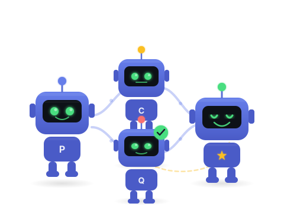
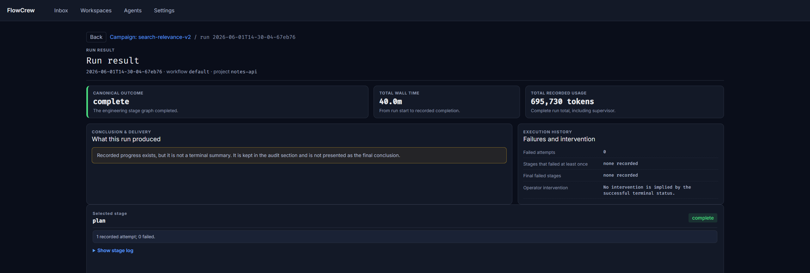
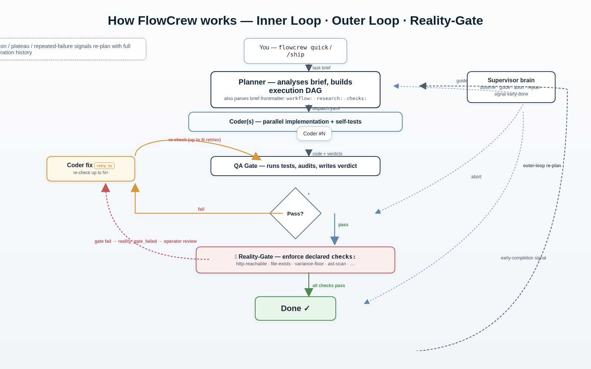
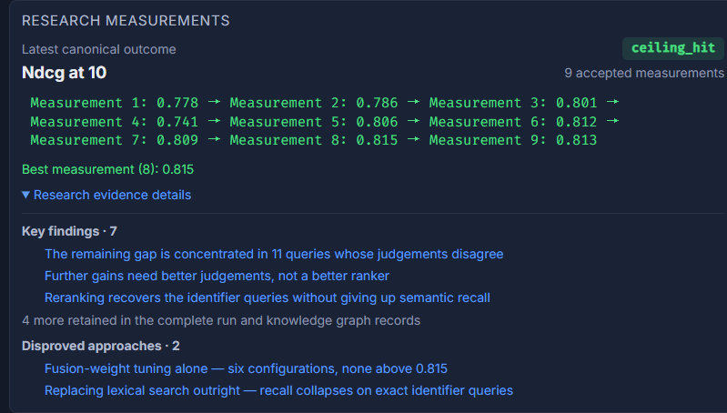

<p align="center">
  
</p>

# FlowCrew

<p align="center"><strong>Give it a brief. Walk away. Come back to a result it has already proven — or an honest "it didn't work."</strong></p>
<p align="center"><em>A self-evolving multi-agent system for long-running AI work — research, RL, refactors, whole features — that ships only what survives its own gates.</em></p>

<p align="center">
  <a href="LICENSE"></a>
  = 22.5" />
  
  
</p>

```text
> Beat the current model on val accuracy. Ship only a result that re-confirms
> on a fresh split.
> /ship
```

`/ship` in Claude Code; `$ship` in Codex.

**Most AI agents are eager to tell you they succeeded. FlowCrew is built to catch itself when it didn't.**

It is a **self-evolving multi-agent system**: hand it a task brief and a supervised crew — planner, coder, researcher, reviewer, QA, supervisor — plans, executes, retries, and **iteratively self-corrects** for hours, unattended, until the result survives its own checks.

A run is called **shipped** only after a check it cannot edit runs and passes.

**You probably don't need FlowCrew** if you want one agent to do one bounded task — use
Codex or Claude Code directly. The gates, supervisor and retry loops only pay for
themselves once the work runs longer than you are willing to sit and watch it.


## You bring the problem. It brings the rigor.

Point FlowCrew at an open-ended goal — *"find an edge in this data," "make this 10× faster," "implement this to spec"* — and its planner decomposes the work, chooses the checks, and drives it to a trustworthy conclusion, unattended for hours. **You don't wire the gates — the engine does.**

The real risk in long autonomous work isn't a wrong answer; it's a *confident* wrong one. So honesty is built into the engine:

- **Verify-before-trust.** A metric win must pass its scripted confirmation; otherwise it is downgraded, not shipped.
- **Honest by construction.** "Found nothing" (**ceiling**), "ran out of budget mid-search" (**incomplete**), and "it worked" (**shipped**) are distinct, first-class outcomes — never a crash dressed up as a win, never faked progress.
- **Self-remediation.** Flaky planning retries instead of dying; an insufficient deliverable gets sent back for rework; a stalled stage is detected and aborted. It gets itself unstuck.
- **Research *and* engineering.** The same engine chases a **metric** (beat a baseline) or satisfies a **contract** (pass the tests) — the planner composes both from the same primitives.

### One loop, from research to engineering

| Point it at… | Kind | What comes back |
|---|---|---|
| Find an edge in a dataset or strategy | research | a real, re-confirmed win — or an honest *"the frontier is exhausted"* |
| Train an agent to beat a baseline | research | a verified beat, or an honest ceiling — never a fake one |
| Make a hot path faster | engineering | a shipped speedup, gated on byte-identical outputs |
| Implement a module to a spec | engineering | a shipped implementation, gated on the full test suite |
| Synthesize cited research | engineering | a report where every claim's source is re-fetched and quoted verbatim |
| Refactor without changing behavior | engineering | a shipped refactor, gated on behavior-pinning tests |

## Requirements

- **Linux, macOS, or WSL2.** WSL2 behaves as Linux whether or not you have enabled systemd;
  systemd is optional everywhere. Where a systemd user session exists it is used for cgroup
  cleanup and crash-restart; elsewhere a portable shim records the run's exit status to disk,
  so an outcome survives a daemon crash. Details: [architecture](guide/architecture.md).

  **macOS is CI-tested, not daily-driven** — the maintainer develops on Linux, and process
  identity there is strong but not exact. [Report anything odd](https://github.com/cuibuaa/flow-crew/issues).
  One outcome the engine cannot recover is a hard-killed supervisor; see
  [run lifecycle](guide/run-lifecycle.md#when-the-supervisor-is-hard-killed).
- **Node.js 22.5+** — FlowCrew uses the built-in `node:sqlite`.
- **An authenticated Codex CLI or Claude Code** — required only for live runs.
- **Git is optional.** Runs work outside a Git repository, but exact commit, diff, and
  untracked-file attribution is unavailable there; a brief's own checks may still require Git.
- **A live run gets unattended shell access to the target project**, for hours — read
  [Before you start](#before-you-start) before launching one.

### Before you start

- **One task per project at a time.** Queue as many as you like — the daemon holds the rest and starts the next when the current one reaches a terminal state. The guard is per project, so tasks in different projects do run concurrently.

`flowcrew quick` runs an already-authored brief without requiring the dashboard; it performs
the shared static preflight before adapter, project, or run mutation.

> [!WARNING]
> **Live runs receive unattended shell access.** The Codex and Claude adapters bypass their normal approval, permission, and sandbox prompts. Starting a live run — from the `ship` skill, from the Dashboard, or with `flowcrew quick` — can therefore give an agent full shell access to the selected project for hours. Use a dedicated workspace or suitably isolated Linux container, and review the task before launch.
>
> **To stop a run:** `flowcrew task cancel <id>`, or Cancel on the dashboard.
>
> Before any launch, FlowCrew runs the same static brief preflight as `rehearse`; consequential findings must be acknowledged with `--acknowledge-brief-warnings`. **Do not hand-edit the project while a run is working in it** — a stage that writes outside its declared paths has those files restored to their pre-stage contents, and attribution is a snapshot diff that cannot tell your edit from the stage's. Start with `flowcrew rehearse` — no agent, no tokens, no changes to your project.

## Get started

**The way in is the `ship` skill from your coding agent.** It interviews you, turns the
discussion into a brief, and rehearses that brief before anything runs. A run's outcome is
decided mostly by its brief, and the skill carries the accumulated rules for writing one
(see the [brief contract](guide/brief-contract.md)). The CLI is how you then watch, steer and
verify.

### 1. Clone, install, and expose the local CLI

```bash
git clone https://github.com/cuibuaa/flow-crew.git && cd flow-crew
npm install
npm link
flowcrew doctor
```

- `npm install` builds the TypeScript engine (`dist/`) and the React dashboard (`ui/dist/`).
- ⚠️ `npm link` silently repoints an existing global `flowcrew` at this clone, with no warning — check with `which flowcrew`.
- Clear whatever `flowcrew doctor` flags before a live run.

There is no public npm package for this release. Upgrade the clone and refresh its copied
skills with:

```bash
git pull --ff-only
npm install
./skills/install.sh
```

`npm unlink -g flowcrew` removes the global package and command link. It does not remove copied
skills; verify ownership, then remove `~/.claude/commands/{ship,fc-status}.md` and `~/.agents/skills/{ship,fc-status}/`.

### 2. Install the coding-agent skills

```bash
./skills/install.sh
```

Any agent CLI not on `PATH` is skipped. Install one with `npm i -g @openai/codex` or
`npm i -g @anthropic-ai/claude-code`, then rerun.
Claude Code receives `/ship` and `/fc-status` under `~/.claude/commands/`. Codex receives the
matching enumerable skills under `~/.agents/skills/`; select them from `/skills`. `flowcrew
doctor` reports missing or outdated copies and prints the exact installer command to repair
them.

### 3. Run the safe, zero-token first task

```bash
flowcrew rehearse examples/hello-research.brief.md
```

A contract-ready verdict means the brief survived a real scheduler rehearsal — frontmatter, loop policy, lifecycle, terminal artifacts and confirm wiring. It does **not** claim any research result is correct: no model runs. See the [rehearsal reference](guide/rehearse.md) and [`examples/README.md`](examples/README.md).

### 4. Ship from your coding agent

Shape the task in the conversation, then invoke `/ship` in **Claude Code** or `$ship` in
**Codex**:

```text
> Split auth into token validation and session management.
> Keep the public API compatible and add focused regression tests.
> /ship        # Claude Code; use $ship in Codex
```

The skill writes a brief, rehearses it for free, and then **shows you its exact digest and waits.**
Nothing is created and nothing is launched until you confirm those precise bytes, so what runs is
what you approved rather than a paraphrase of it.

On confirmation it prepares an isolated launch workspace — a worktree on its own branch, with the
declared inputs linked and the project's own build, test, and lint commands measured there to fix a
baseline the gates will hold the run to. Your working checkout is left alone; permitted edits land
in that workspace for review. The engine itself never commits, tags, pushes, or opens a pull
request, and a shell-enabled worker commits only if the brief explicitly asks it to.

When the run ends, `flowcrew land` audits that workspace before you remove it: it grades every
unique file, refuses while anything it could not prove regenerable remains, and makes you state the
regenerable count out loud. Hand teardown is how work gets lost — a 2,379-line generator went that
way — so the command exists to make the loss impossible rather than unlikely.

### 5. Watch it, and be there when it needs you

```bash
flowcrew start          # then open http://localhost:3000/
```

The default port `3000` is overridable with `PORT=<n> flowcrew start`.

<p align="center">
  
</p>

One place to see what the crew is doing. A **run page** shows live progress, the stage graph,
every stage's output and the tokens it cost. A **campaign page** rolls several runs up into
findings, disproved approaches and the best measurement so far.

The surface that matters most while you are away is the **inbox**. A run that reaches a
consequential action — spending money, deploying, touching something live — does not decide
for you and does not die: it **parks**, frees its queue slot, and waits. Approve or deny it
there or with `flowcrew inbox`, and the same run resumes where it stopped. The inbox also
collects tasks deferred behind a busy project, runs that have gone stale, and pending brief
edits, so "what is waiting on me?" is one page rather than a hunt.

### Run it your way — Codex, Claude, or both

FlowCrew runs end to end on **Codex or Claude** — either works on its own.

**We recommend: plan in Claude Code, execute in Codex.** Long multi-agent sub-runs are token-hungry, and Claude subscription budgets deplete faster than Codex's — so shape the plan where the conversation flows best (Claude Code), then hand the heavy execution to Codex (the default backend).

### From brief to verified run

<p align="center">
  <picture>
    <source media="(prefers-color-scheme: dark)" srcset="assets/how_it_works_dark.png" />
    
  </picture>
</p>

## What you can run

Three shapes of work, all entered the same way — describe it in your coding agent, then invoke
the `ship` skill. The prompts below are illustrative of the shape, not transcripts of runs:
the one brief in this repository you can execute as written is
[`examples/hello-research.brief.md`](examples/hello-research.brief.md).

### Research loop (metric) — beat a baseline, honestly

```text
> Beat our current docs-search relevance baseline. Only ship a result that
> re-confirms on a fresh split — an honest ceiling is a fine answer.
> /ship
```

The skill turns that into a brief whose frontmatter declares the baseline, the stopping
policy and the command that must pass before anything ships. `examples/hello-research.brief.md`
is a complete one — read it, or replay it with
`flowcrew rehearse examples/hello-research.brief.md`.

### Engineering (acceptance) — satisfy a contract

```text
> Add a public test proving `flowcrew --help` lists every top-level command.
> Don't change any command's behavior.
> /ship
```

The same engine-owned decision and confirm gate carry engineering work — the engine parses
`objective:` and `research:` identically, so use `objective:` when the bar is a contract
rather than a metric. Its `confirm.command` is what must pass, for example
`npm run build && npm test`.

### Unknown bug hunt

A **campaign** groups related runs and carries outcomes, approaches, failures, dead ends, and
pivots across attempts.

```text
> Find the root cause of the intermittent checkout failure. Add a reproducer
> that fails before the fix, then make it pass 50× consecutively. Don't
> re-try a hypothesis this campaign already marked a dead end.
> /ship
```

Dead ends from earlier runs in the campaign are handed to the planner as facts, not suggestions.

See [Brief and file contract](guide/brief-contract.md) for every frontmatter and runtime
artifact field, and [`examples/README.md`](examples/README.md) for the tracked example and the
mock flows around it. Launching a brief you already have from the command line — for scripted
or scheduled runs — is in the [CLI reference](guide/cli.md).

## What makes it work

FlowCrew is a **self-evolving multi-agent architecture** built on a small set of **execution primitives ("atoms")**
and a **harness loop**: the planner composes your goal from those atoms, and the crew iterates — plan, execute, gate,
re-plan — self-correcting until the result survives its own checks. The engine stays **task-agnostic** — every
task-specific rule lives in the brief and its declared checks, never in the core — so the same loop carries research
and engineering alike. Three design choices carry the weight.

### A crew of roles, and one authority withheld

A run is carried out by specialists — a planner, a coder, a researcher, a reviewer, a QA gate —
each seeing only the context its own job needs. **The planner emits a stage graph the scheduler
executes literally**, written in a fixed vocabulary the engine validates, so a role it invents
is rejected rather than guessed at.
A **supervisor** watches the run rather than the task — it samples progress, sends insufficient
work back, ends a stage that has gone quiet, and can force a re-plan — but it never decides
that the work is done.

**The same population of models writes the work,
measures the work, and judges the measurement**, so a natural-language opinion that the bar was
met is not independent evidence. What ends a run successfully is the **Reality Gate**: the
checks the work declared for itself, executed as scripts. Only success is gated — a failure
needs no proving. The crew can raise this bar on itself, because the planner may add checks for
constraints it derives from the goal. Nothing in the crew can lower it.

The [architecture guide](guide/architecture.md) has the grammar, the anti-tampering rules and
the scope machinery in full.

### Every hand-off is a checkable artifact, not a message

Agents in FlowCrew never pass each other free-form prose. Every hand-off — the plan, the work,
a verdict, a scope request, an approval — is a typed artifact at a known path in the run
directory, with one producer and one consumer, and a malformed one is refused rather than
interpreted. The [brief contract](guide/brief-contract.md) lists them.

A stage that writes outside its declared paths has those files **restored to their pre-stage contents**.

### Knowing when to stop is a rule, not a judgement call

In research mode the crew proposes and measures, but whether a result is kept, and whether to
continue, ship, or declare a ceiling, is computed from the history of results by a fixed
policy. A round counts as an improvement
only if it beats the running best by more than the measurement's own uncertainty, so noise
cannot be banked as progress.

### When this is the wrong tool

<details>
<summary><strong>Compared with scripted / in-session orchestration</strong></summary>

(e.g. a Claude Code <em>Workflow</em> — a script that fans work out to subagents, authored and
conducted from your session)

| Scripted / in-session orchestration | FlowCrew |
|---|---|
| A single fan-out you conduct — chain more rounds by hand | A self-governing loop: hours to days, cross-session, resumable |
| You author the control flow (the stage DAG) | The planner generates the stage DAG from a plain-language brief |
| **You** hold terminal authority — read each result, decide what's next | The **engine** self-governs done / ship / ceiling / rework |
| Verification is whatever you script in | Verify-before-trust + Reality-Gate are built in |
| Results return to you; no cross-run memory | Persistent run memory + campaign knowledge graph |
| Best for a bounded fan-out you drive now | Best for fire-and-forget autonomous research/engineering |

They are complementary. Reach for a Workflow to reason inside a conversation; reach for
FlowCrew when the work must outlive the chat and something has to decide, honestly, when it
is genuinely done.

</details>

## Run memory

FlowCrew records *why* a run made decisions, not just what changed. A run captures goals, approaches, findings, insights, results, cited sources, and dead ends as a knowledge graph, and the engine reads it back: a dead end marked in one round is one the planner is told not to re-propose in the next.

Across a campaign those graphs roll up into a **knowledge digest** — findings and insights in one list, disproved approaches in another, deduped across runs by substance so the same finding reported three times collapses to one entry, each linking back to the run that produced it. Alongside it the campaign page names the best measurement per direction, and says plainly when the evidence is not enough to name one.

<p align="center">
  
</p>

The full graph is per run, on that run's page. Node types, and what reads each one back:

| Type | Recorded when | What reads it back |
|---|---|---|
| `goal` | the objective a run is pursuing | summarised into every later stage's prompt |
| `approach` | a strategy the planner chose | same, carrying its score; retired to a dead end when the campaign stops improving |
| `result` | a measured outcome | plateau detection and the improvement ratchet |
| `dead_end` | a direction that failed | the planner, as a direction not to propose again — plus the campaign digest |
| `user_hint` | guidance you gave mid-flight | summarised into every later stage's prompt |
| `finding` | evidence discovered during work | the campaign digest |
| `insight` | a reusable lesson | the campaign digest |
| `source` | an external reference cited during research | **nothing yet** — it is captured and stored, but no engine path or view reads it back |

## Configuration

FlowCrew reads `config/defaults.yaml` (`auto` recommends Codex when both CLIs are installed):

```yaml
default_timeout_ms: 3600000
default_max_iterations: 5
default_gate_retry_loops: 3
default_stage_technical_retries: 1     # adapter/transport retry, separate from gate loops
default_plan_stage_retries: 2          # transient empty/invalid plan → bounded retry, not fatal
default_supervisor_max_rejects: 2      # supervisor can send a deliverable back, bounded

adapter: auto
session_reuse: false                   # measured benefit was ~9% wall clock; off by default
model: default                         # inherit the adapter's own config unless set here
reasoning_effort: default

campaign_triggers:
  enabled: true
  regression_after: 2
  plateau_after: 3
  plateau_threshold: 5
  repeated_failure_after: 3

supervisor:
  poll_interval_ms: 30000
  routine_assessment_interval_ms: 180000
  stuck_threshold_ms: 600000           # no-progress stage watchdog
```

A brief's `research:` (or `objective:`) block drives the native loop and its honesty gates:

```yaml
research:
  baseline: 0.72
  higher_is_better: true
  integrity:
    field_floors: { real_train_iters: 150 }   # anti-smoke: reject token rounds
  confirm:
    command: "bash confirm.sh"                 # verify-before-trust: must pass before `shipped`
```

## Command line

Reach for the command line when you want a scripted or scheduled launch, a brief you already
wrote, or an operational answer about the install itself.

Day-one commands:

```bash
flowcrew doctor                   # is this install actually ready?
flowcrew adapter                  # current choice, installed CLIs, and recommendation
flowcrew adapter claude           # set an installed backend explicitly
flowcrew rehearse <brief.md>      # replay a brief for free before spending anything
flowcrew ship-preflight --brief <brief.md>  # inspect inputs, history, and validation baseline
flowcrew ship-setup --brief <brief.md> --target <dir> --base <ref> --branch <name>
flowcrew watch                    # heartbeat plus edge-triggered live-run stall judgements
flowcrew land --run <id>          # audit a finished run's workspace before removing it
flowcrew audit-report --report <file> --run-dir <dir>  # re-derive a report's numbers and paths
flowcrew status                   # latest run for the current project
flowcrew status --all             # latest run across all projects
flowcrew status --project ../app  # inspect another project explicitly
flowcrew start                    # open the web dashboard
flowcrew task cancel <id>         # stop a run
```

`flowcrew init` picks a backend once and writes it into the project; change it later with
`flowcrew adapter <name>`.

Every command — including fail-closed launch setup, tested watching, safe landing, and report
auditing — is documented with its options and exit codes in the
**[CLI reference](guide/cli.md)**.

## Known issues

Defects reproduced on the current release. Fixes land in the [changelog](CHANGELOG.md).

- **A `config/defaults.yaml` that fails to parse is not self-repairing.** `flowcrew
  doctor` names the exact parse error with line and column, but the `flowcrew init` it
  suggests will not overwrite an existing file, so the fix is currently manual.

**Dependency status:** `npm audit` reports two moderate advisories in `ui/` (React Router), both dev-only — `npm audit --omit=dev` reports none.

## Documentation

- [Atom Architecture](design/atom-architecture.md): self-describing atoms and the planner composition model.
- [Architecture](guide/architecture.md): scheduler, worker, supervisor, loops, storage.
- [Run Lifecycle](guide/run-lifecycle.md): every run status and what it means for the operator.
- [Brief and File Contract](guide/brief-contract.md): frontmatter and agent-engine artifacts.
- [Approval Inbox](guide/approvals.md): park/resume, decisions, CLI, dashboard, and standing rules.
- [Zero-token Rehearsal](guide/rehearse.md): what the wind tunnel proves and what it cannot prove.
- [Campaigns and Run Memory](guide/campaigns.md): campaigns, plateaus, pivots, knowledge graph.
- [Reality-Gate](guide/reality-gate.md): deterministic evidence checks before terminal success.
- [Configuration](guide/configuration.md): defaults, adapters, per-role overrides, supervisor settings.
- [Agent Skills](guide/skills.md): Claude Code slash commands, Codex skills, and installation.
- [CLI Reference](guide/cli.md): every command with its subcommands and options.
- [Contributing](CONTRIBUTING.md): build, test, documentation, commit, and PR expectations.

## License

[MIT](LICENSE)

## Author

Single-maintainer project. FlowCrew Captain — LinkedIn: [Profile](https://www.linkedin.com/in/qian-cui/)
