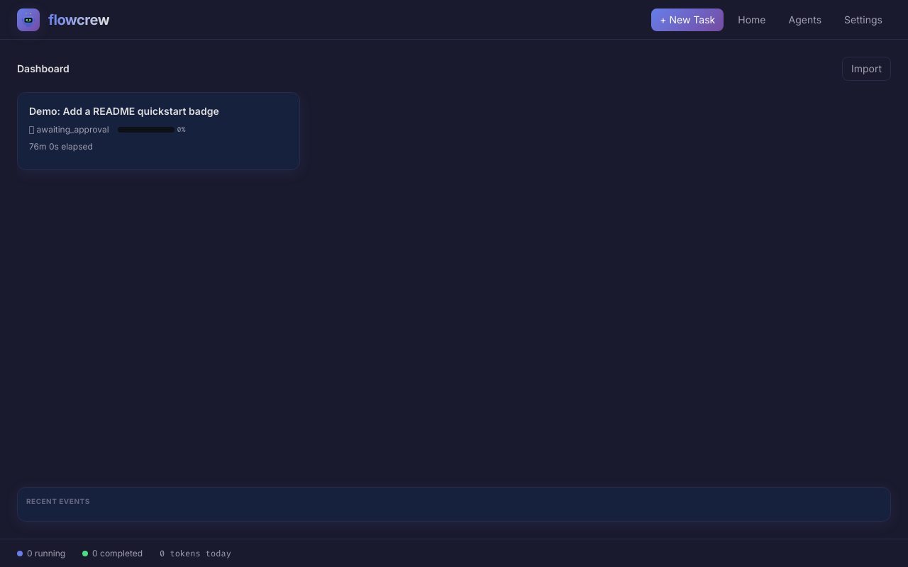
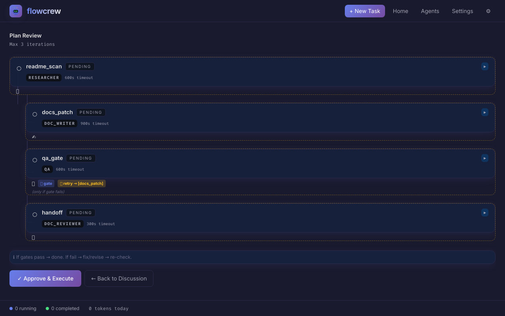
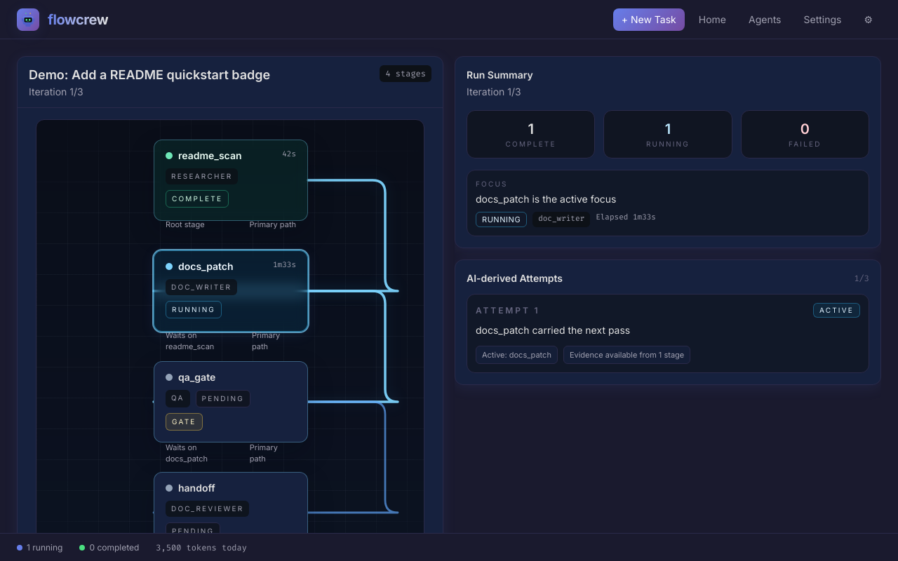
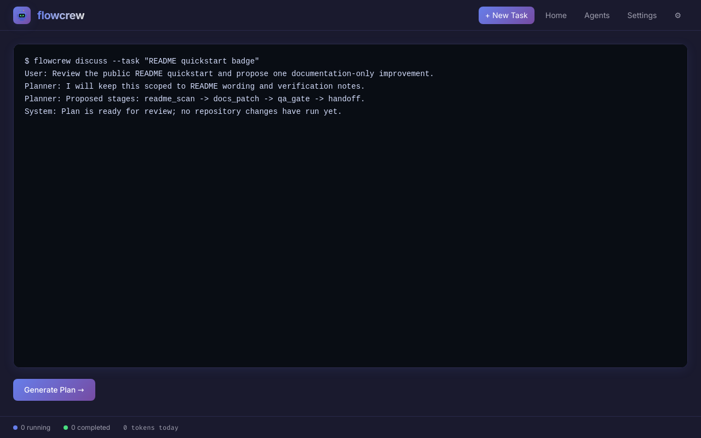

<p align="center">
  
</p>

<p align="center"><em>YAML-driven multi-agent orchestration with a real-time dashboard</em></p>

<p align="center">
  <a href="LICENSE"></a>
  = 20" />
</p>

## What it is

FlowCrew lets you define multi-stage AI workflows in YAML, assign stages to different agents, and orchestrate them with persistent state, automatic retries, and a live web dashboard. No CLI required — just `npm run dev` and open the browser.

## ✨ Features

- 🔄 **YAML Workflows** — Define multi-stage pipelines declaratively
- 🤖 **Multi-Agent** — Assign different AI agents to different stages
- 🔌 **Adapter System** — Codex (default) and Claude (**Experimental**)
- 📊 **Live Dashboard** — Real-time stage progress, terminal output, discussion UI
- 💬 **Interactive Discussion** — PTY-based agent conversations for task planning
- 🔁 **Auto-Retry & Iteration** — Configurable retries with verdict-based loops
- 📁 **Persistent State** — Run state survives restarts (`.fc/runs/`)
- 🛡️ **Skills** — Inject domain knowledge via Markdown skill files

## 🎯 Design

**Visible Execution Plan**
The planner agent analyzes a task and produces `dispatch.yaml` — a topologically-sorted DAG of stages. The dashboard shows this plan for human review before execution. Once approved, stages run in parallel where dependencies allow.

**Two-Layer Retry Loop**
Inner loop — when a QA gate fails, the targeted fix stage re-runs and the gate re-checks (up to 3×). Outer loop — if the inner loop exhausts retries, the system re-plans with full iteration history (up to `max_iterations`). QA writes NEW and DIFFERENT tests each cycle to avoid repeating the same checks.

**Campaign Intelligence**
Score tracking across runs via JSONL. The system auto-detects regression (score drops after N runs), plateau (score stuck within threshold for N runs), and repeated failures. When detected, it triggers a strategy pivot — the planner gets campaign context and adjusts approach.

## 🧭 Use Cases

**Campaign-driven development** — Link multiple runs into a campaign. Run #3 automatically knows what #1 and #2 tried, what scored well, and what failed. FlowCrew detects plateaus (score stuck for N runs), regressions (score drops), and repeated failures — then triggers a strategy pivot. You keep iterating on the same goal and the system builds on prior work.

**Autonomous research** — Set up a pipeline with the `researcher` role (web search + fetch), `paper_writer`, `paper_reviewer` (numerical scoring), and `ai_detector`. The whole chain runs with QA gates — if the reviewer scores below threshold, the writer revises. Works for literature surveys, technical reports, or any knowledge-gathering workflow.

**Interactive task scoping** — Before any code runs, the Discussion UI lets you talk to the planner. Using skills like Socratic clarification, it asks probing questions about scope, constraints, and edge cases. Once aligned, it writes a `task_brief.md` and produces an execution plan you review visually before approving.

**Self-correcting code pipelines** — The two-layer retry loop means you don't babysit. QA writes new tests each cycle (not the same checks), the coder fixes, and the gate re-checks. If the inner loop exhausts retries, the planner re-plans with full iteration history. Set `max_iterations` and walk away.

**Custom agent roles** — Drop a YAML in `config/agents/` to create any role. Ships with: planner, coder, qa, researcher, paper_writer, paper_reviewer, ai_detector, doc_writer, doc_reviewer, discussion. Each defines its own tools, prompt, and identity. Mix and match in workflow stages.

## 🔄 How It Works

1. **Create a task** — Click "+ New Task" in the dashboard. Optionally attach it to a campaign to build on previous runs.
2. **Discuss** — Chat with the planner agent in the Discussion tab. It clarifies requirements and writes `task_brief.md`.
3. **Review the plan** — The planner produces `dispatch.yaml` — a DAG of stages with roles, dependencies, and gates. You see it visually in Plan Review and can approve or send back.
4. **Execute** — Approved stages run in parallel where dependencies allow. The Live Monitor shows real-time terminal output per stage.
5. **QA gates** — Gate stages run tests and produce verdicts with scores. Failed gates trigger the inner retry loop (fix → re-check, up to 3×).
6. **Iterate** — If inner retries exhaust, the outer loop re-plans with full history. Campaign-aware runs also get cross-run context for smarter pivots.
7. **Done** — Final scores are logged to the campaign JSONL. The next run in the campaign starts with this context.

## Architecture

```
┌─────────────┐     ┌────────────┐     ┌──────────────┐
│     UI      │────▶│  Scheduler │────▶│   Adapters   │
│  Dashboard  │     │  (stages)  │     │ codex|claude │
└─────────────┘     └────────────┘     └──────────────┘
       │                  │                    │
       ▼                  ▼                    ▼
┌─────────────┐     ┌────────────┐     ┌──────────────┐
│  Dashboard  │     │   Store    │     │  Agent YAML  │
│  (Fastify)  │     │ .fc/runs/  │     │ config/agents│
└─────────────┘     └────────────┘     └──────────────┘
```

## 📸 Screenshots

| Dashboard | Plan Review |
|:-:|:-:|
|  |  |

| Live Monitor | Task Discussion |
|:-:|:-:|
|  |  |

## 🚀 Quick Start
FIRST, Get your backend agent cli (Codex or Claude Code) Installed. 
```bash
npm install
npm run dev
```

Opens the dashboard at http://localhost:3000.

1. Open http://localhost:3000
2. Click "+ New Task", give it a name (optionally link to a campaign)
3. Describe what you want in the Discussion tab — the planner will ask clarifying questions
4. Review the generated execution plan in Plan Review → click Approve
5. Watch stages execute in real-time on the Live Monitor
6. Check results — QA gates show pass/fail verdicts with scores

## Adapters

| Adapter | Status | Default |
|---------|--------|---------|
| Codex   | Stable | ✅      |
| Claude  | **Experimental** — not fully tested | —       |

Set the adapter in `config/defaults.yaml`.

## 🧩 Skills

Skills are Markdown files in `config/skills/` that inject domain knowledge into agent prompts. Ships with `deep-interview.md` (adapted from [oh-my-codex](https://github.com/Yeachan-Heo/oh-my-codex)) which teaches agents Socratic clarification — probing for scope, constraints, and edge cases before acting. Create your own skills for project-specific conventions, coding standards, or review criteria.

## Example Workflow

```yaml
name: engineering
defaults:
  timeout_ms: 1800000
  max_retries: 2
stages:
  - id: plan
    role: planner
    prompt_template: "Analyze the task and create a plan."
  - id: implement
    role: engineer
    depends_on: [plan]
    prompt_template: "Implement the plan from the previous stage."
  - id: verify
    role: reviewer
    depends_on: [implement]
    prompt_template: "Review and verify the implementation."
```

## Project Structure

```
├── src/
│   ├── index.ts             # Entry point
│   ├── dashboard.ts         # Fastify server + API
│   ├── scheduler.ts         # Workflow execution engine
│   ├── store.ts             # Persistent run state
│   ├── worker.ts            # Stage worker
│   ├── condition.ts         # Condition evaluation
│   ├── handoff.ts           # Stage handoff logic
│   └── adapters/
│       ├── base.ts          # Adapter interface
│       ├── codex.ts         # Codex adapter
│       └── claude.ts        # Claude adapter
├── config/
│   ├── defaults.yaml        # Global defaults
│   ├── agents/              # Agent role configs
│   ├── workflows/           # Workflow definitions
│   └── skills/              # Skill documents
├── ui/                      # React dashboard (Vite + Tailwind)
├── assets/                  # Mascot, screenshots
└── .github/                 # Issue & PR templates
```

## License

[MIT](LICENSE)

## Author

FlowCrew Captain  
LinkedIn: [Profile](https://www.linkedin.com/in/qian-cui/)
