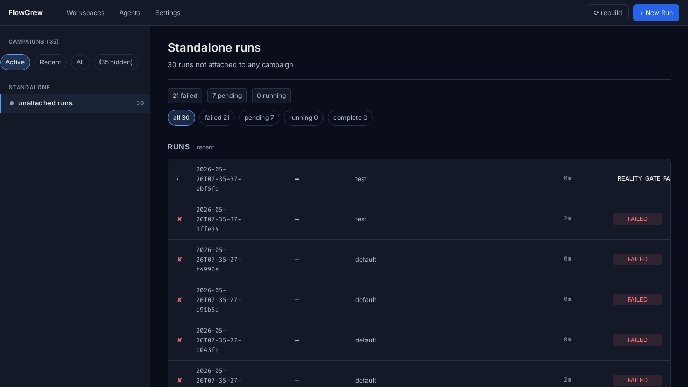
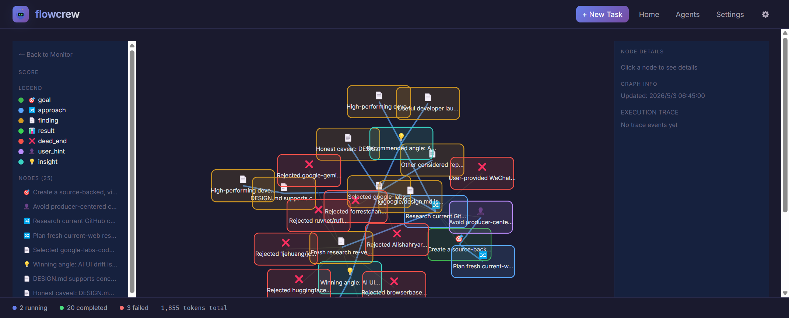

<p align="center">
  
</p>

# FlowCrew

<p align="center"><strong>The orchestration layer for AI work that should not fit in one chat.</strong></p>
<p align="center"><em>Plan in Claude Code. Ship through Codex. Verify with QA gates. Preserve what every run learned.</em></p>

<p align="center">
  <a href="LICENSE"></a>
  = 22.5" />
  
  
  
</p>

```bash
flowcrew quick "fix the checkout race condition and prove it with a regression test"
```

FlowCrew turns a task brief into a supervised team of agents: planner, coder, researcher, reviewer, QA, and supervisor. It is built for work that needs retries, evidence, long-running execution, and memory across attempts.

It is not just a prompt runner. FlowCrew gives your AI workflow a run state, a dashboard, deterministic reality checks, and a knowledge graph of decisions, findings, results, and dead ends.

<p align="center">
  
</p>

## Highlights

| Highlight | What It Gives You |
|---|---|
| **Claude Code planning -> Codex execution** | Discuss the plan conversationally, then use `/ship` to dispatch the confirmed work to FlowCrew's Codex-default backend. |
| **Planner-generated DAG** | The planner turns a brief into explicit stages with dependencies, gates, and retries. |
| **QA gate retry loop** | Failed gates trigger targeted fix stages and re-checks instead of asking you to babysit the run. |
| **Backend-driven supervisor** | A configurable observer reads stage output and run state, then guides, aborts, replans, or detects completion. |
| **Run Memory Graph** | Goals, approaches, findings, insights, results, user hints, and dead ends stay attached to the run. |
| **Campaign intelligence** | Related runs share metrics and failure history so future attempts can pivot instead of repeat. |
| **Reality-Gate** | Deterministic checks block fabricated or unsupported terminal success. |
| **Dashboard + CLI + skills** | Use the interface that fits the moment: `/ship`, terminal, or browser dashboard. |

<p align="center">
  
</p>

## The Recommended Loop

FlowCrew works best as the execution layer behind your interactive coding agent:

```text
1. Discuss scope, constraints, and acceptance criteria in Claude Code.
2. Type /ship.
3. FlowCrew creates a task brief and dispatches it to Codex by default.
4. Agents plan, execute, verify, retry, and summarize.
5. You inspect the dashboard, run summary, artifacts, and knowledge graph.
```

Why this pairing works: Claude Code is strong for collaborative plan shaping, while Codex is the default FlowCrew execution backend and is often the better fit for long multi-agent sub-runs when your Codex subscription has more generous execution budget.

Install the skills once:

```bash
./skills/install.sh
```

Then ship from the conversation:

```text
> Split auth into token validation and session management.
> Keep the public API compatible and add focused regression tests.
> /ship
```

## From Brief To Verified Run

<p align="center">
  
</p>

The important boundary: the supervisor steers, but it does not edit files or run commands directly. Work happens in worker stages; evidence is checked by gates and Reality-Gate.

## Why It Is Different

| One-shot agent | FlowCrew |
|---|---|
| Best effort answer | Auditable run with state, artifacts, verdicts, and summary |
| One context window | Persistent run memory and campaign history |
| Manual retry after failure | Gate -> fix -> re-gate loop |
| "Looks done" | Deterministic evidence checks before terminal success |
| Lost rationale | Knowledge graph of decisions and evidence |
| Single backend assumption | Codex default with Claude/Codex per-role overrides |

## Architecture: Atoms

FlowCrew is built on **self-describing atomic semantics**. Every composable primitive — roles, skills, deterministic checks, research policies, terminal/verdict vocabularies — describes itself, is collected into a registry, and is injected into the planner at runtime. The planner composes a run from these atoms, and each atom maps to the roles that execute it.

The invariant that keeps this maintainable: **semantics live at the atom's own source, injected at runtime — the planner prompt is a stable composition engine, never a semantics dictionary. Domain-specific semantics live in the brief / project contract, never in the engine.** Adding a role, check, or skill needs zero planner-prompt edits, and a project's hard constraints (declared in `<project>/.flowcrew/contract.yaml`) are wired by the planner into deterministic Reality-Gate checks.

See [`design/atom-architecture.md`](design/atom-architecture.md) for the full rationale, the drift problem it solves, and the roadmap.

## Quick Start

```bash
npm install
npx flowcrew init
npx flowcrew doctor
```

Ship directly:

```bash
flowcrew quick "fix the failing checkout flow and add a regression test"
```

Ship from a file or stdin:

```bash
flowcrew quick --task "$(cat task.md)" --max-iterations 3 --timeout 600000
echo "audit docs for stale API examples" | flowcrew quick -
```

Start the dashboard:

```bash
npx flowcrew start
```

Open [http://localhost:3000](http://localhost:3000) to inspect live stages, QA verdicts, artifacts, campaign scores, summaries, and run memory.

## What You Can Run

### Unknown bug hunt

```bash
flowcrew quick --campaign checkout-bug "Find the root cause of an intermittent checkout failure.
Acceptance:
1. Add a reproducer test that fails before the fix.
2. Document the root cause in docs/root_cause_checkout.md.
3. Fix the bug and make the reproducer pass 50 consecutive times.
4. Do not repeat any hypothesis already marked dead_end in the campaign."
```

### Research loop

```bash
flowcrew quick --campaign model-eval "Improve src/model.py on data/validation.jsonl.
Baseline: accuracy 0.72. Target: accuracy >= 0.85.
Each iteration tries one new approach, records the metric, and stops after target hit or two non-improving rounds."
```

### Review-gated writing

```bash
flowcrew quick "Polish docs/design.md until reviewer score is >= 8/10 on clarity, evidence, and reproducibility.
Never invent citations, never change reported numbers, and only rewrite passages the review gate flags."
```

## Run Memory

FlowCrew records why a run made decisions, not just what files changed.

<p align="center">
  
</p>

Common node types:

| Type | Meaning |
|---|---|
| `goal` | The objective being pursued |
| `approach` | Strategy selected by the planner |
| `finding` | Evidence discovered during work |
| `insight` | Reusable lesson from a stage or iteration |
| `result` | Measured outcome |
| `dead_end` | Failed direction that future runs should avoid |
| `user_hint` | Human guidance preserved for future stages |

## Configuration

FlowCrew reads `config/defaults.yaml`. The current default backend is Codex:

```yaml
default_timeout_ms: 3600000
default_max_iterations: 5
default_gate_retry_loops: 3

adapter: codex
model: default
reasoning_effort: default

supervisor:
  stuck_threshold_ms: 600000
  # Optional: use Claude for higher-level supervision while stages use Codex.
  # adapter: claude
  # model: claude-opus-4-7
  # reasoning_effort: high
```

Override a single role when useful:

```yaml
# config/agents/qa.yaml
adapter: claude
model: claude-opus-4-7
reasoning_effort: xhigh
```

## CLI

```bash
flowcrew init
flowcrew quick "task"
flowcrew quick "task" --background
flowcrew status
flowcrew list
flowcrew guide "message"
flowcrew start
flowcrew doctor
flowcrew audit-reality
```

## Documentation

- [Atom Architecture](design/atom-architecture.md): self-describing atoms, the planner composition model, and the design roadmap.
- [Architecture](docs/architecture.md): scheduler, worker, supervisor, loops, and storage.
- [Campaigns and Run Memory](docs/campaigns.md): campaigns, plateaus, pivots, and knowledge graph semantics.
- [Reality-Gate](docs/reality-gate.md): deterministic evidence checks before terminal success.
- [Configuration](docs/configuration.md): defaults, adapters, per-role overrides, supervisor settings.
- [Agent Skills](docs/skills.md): `/ship`, `/fc-status`, and skill installation.
- [CLI Reference](docs/cli.md): command list and common flags.

## License

[MIT](LICENSE)

## Author

FlowCrew Captain
LinkedIn: [Profile](https://www.linkedin.com/in/qian-cui/)
