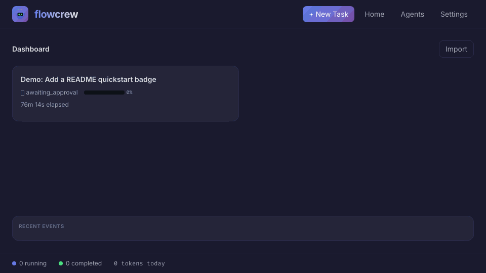
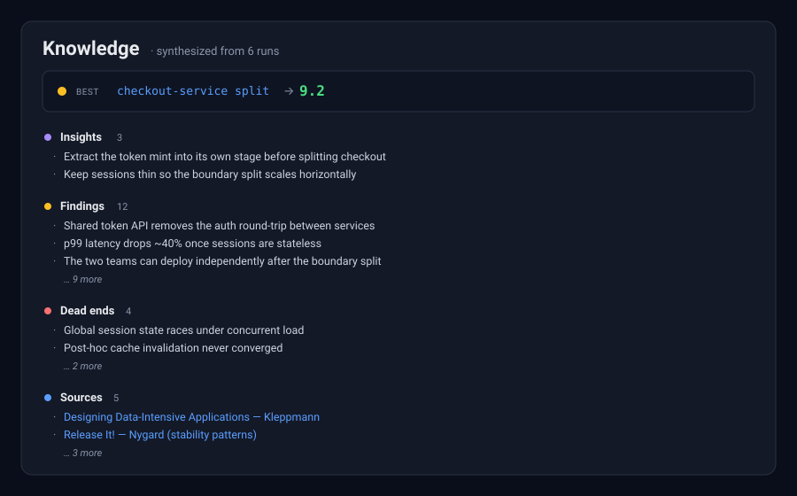

<p align="center">
  
</p>

# FlowCrew

<p align="center"><strong>Give it a brief. Walk away. Come back to a result it has already proven — or an honest "it didn't work."</strong></p>
<p align="center"><em>Long-running AI work — research, RL, refactors, whole features — that ships only what survives its own gates.</em></p>

<p align="center">
  <a href="LICENSE"></a>
  = 22.5" />
  
  
  
</p>

```bash
flowcrew quick "beat the current model on val accuracy — ship only a result that re-confirms on a fresh split"
```

**Most AI agents are eager to tell you they succeeded. FlowCrew is built to catch itself when it didn't.**

Hand it a task brief and it runs as a supervised crew — planner, coder, researcher, reviewer, QA, supervisor — that plans, executes, retries, and checks its own work for hours, unattended.

And the difference isn't one clever check at the end — it's systemic. Self-checking, exploring, and self-correcting are designed into every step: the planner probes the problem and stages the work, gates catch weak output and fire targeted fixes, the supervisor retries and sends insufficient work back — and only after all that does an *independent* re-check decide whether the result is real enough to call **shipped**. Beat the metric but fail that check? Downgraded, not shipped. It reports honest negatives, refuses to fake progress, and remembers every dead end so the next run never repeats it.

A one-shot agent hands you a best-effort answer. FlowCrew hands you an auditable result you can trust — because it didn't trust itself first.

<p align="center">
  
</p>

## You bring the problem. It brings the rigor.

Point FlowCrew at an open-ended goal — *"find an edge in this data," "make this 10× faster," "implement this to spec"* — and its planner decomposes the work, chooses the checks, and drives it to a trustworthy conclusion, unattended for hours. **You don't wire the gates — the engine does.**

The real risk in long autonomous work isn't a wrong answer; it's a *confident* wrong one. So honesty is built into the engine, not left to how closely you're watching:

- **Verify-before-trust.** Before the engine calls a run **shipped**, it re-confirms the win with an *independent* check it set up itself. Beat the metric but fail the re-check? Downgraded, not shipped.
- **Honest by construction.** "Found nothing" (**ceiling**), "ran out of budget mid-search" (**incomplete**), and "it worked" (**shipped**) are distinct, first-class outcomes — never a crash dressed up as a win, never faked progress.
- **Self-remediation.** Flaky planning retries instead of dying; an insufficient deliverable gets sent back for rework; a stalled stage is detected and aborted. It gets itself unstuck.
- **Research *and* engineering.** The same engine chases a **metric** (beat a baseline) or satisfies a **contract** (pass the tests) — the planner composes both from the same primitives.

### One loop, from research to engineering

You give the goal; it does the rest. A sense of what that looks like across the spectrum:

| Point it at… | Kind | What comes back |
|---|---|---|
| Find an edge in a dataset or strategy | research | a real, re-confirmed win — or an honest *"the frontier is exhausted"* |
| Train an agent to beat a baseline | research | a verified beat, or an honest ceiling — never a fake one |
| Make a hot path faster | engineering | a shipped speedup, gated on byte-identical outputs |
| Implement a module to a spec | engineering | a shipped implementation, gated on the full test suite |
| Synthesize cited research | engineering | a report where every claim's source is re-fetched and quoted verbatim |
| Refactor without changing behavior | engineering | a shipped refactor, gated on behavior-pinning tests |

## Why FlowCrew is different

**vs a one-shot agent**

| One-shot agent | FlowCrew |
|---|---|
| Best-effort answer | Auditable run: state, artifacts, verdicts, summary |
| One context window | Persistent run memory + campaign history |
| Manual retry after failure | Gate → fix → re-gate loop, self-remediating |
| "Looks done" | Deterministic evidence + independent confirm before `shipped` |

**vs scripted / in-session orchestration** (e.g. a Claude Code *Workflow* — a script that fans work out to subagents, authored and conducted from your session)

| Scripted / in-session orchestration | FlowCrew |
|---|---|
| A single fan-out you conduct — chain more rounds by hand | A self-governing loop: hours to days, cross-session, resumable |
| You author the control flow (the stage DAG) | The planner generates the stage DAG from a plain-language brief |
| **You** hold terminal authority — read each result, decide what's next | The **engine** self-governs done / ship / ceiling / rework |
| Verification is whatever you script in | Verify-before-trust + Reality-Gate are built in |
| Results return to you; no cross-run memory | Persistent run memory + campaign knowledge graph |
| Best for a bounded fan-out you drive now | Best for fire-and-forget autonomous research/engineering |

They are complementary. Scripted orchestration is a tool you *conduct* within a chat; FlowCrew is the system you *hand a brief* and trust to run — and to gate its own honesty — while you are away. Reach for a Workflow to reason inside a conversation; reach for FlowCrew when the work must outlive the chat and something has to decide, honestly, when it is genuinely done.

## Get started

**1. Install** (once):

```bash
npm install
npx flowcrew init
npx flowcrew doctor
./skills/install.sh          # adds /ship to your coding agent
```

**2. Ship from your coding agent.** Shape the task in the conversation — in **Codex or Claude Code** — then `/ship` it:

```text
> Split auth into token validation and session management.
> Keep the public API compatible and add focused regression tests.
> /ship
```

FlowCrew turns the confirmed discussion into a brief, runs the crew, and reports back — while you watch the dashboard or walk away.

### Run it your way — Codex, Claude, or both

FlowCrew runs end to end on **Codex or Claude** — either works on its own.

**We recommend: plan in Claude Code, execute in Codex.** Long multi-agent sub-runs are token-hungry, and Claude subscription budgets deplete faster than Codex's — so shape the plan where the conversation flows best (Claude Code), then hand the heavy execution to Codex (the default backend).

Prefer one tool? Run the whole loop on **Codex** (the default) — or entirely in **Claude Code**. The split is a token-budget optimization, not a requirement.

## From brief to verified run

<p align="center">
  
</p>

The important boundary: the supervisor **steers** but never edits files or runs commands. Work happens in worker stages; evidence is checked by gates, Reality-Gate, and — before any `shipped` — the confirm-gate.

## Architecture: Atoms

FlowCrew is built on **self-describing atomic semantics**. Every composable primitive — roles, skills, deterministic checks, research policies, terminal/verdict vocabularies — describes itself, is collected into a registry, and is injected into the planner at runtime. The planner composes a run from these atoms; each atom maps to the roles that execute it.

The invariant that keeps this maintainable: **semantics live at the atom's own source, injected at runtime — the planner prompt is a stable composition engine, never a semantics dictionary. Domain-specific logic lives in the brief / project contract, never in the engine.** Adding a role, check, or skill needs zero planner-prompt edits, and a project's hard constraints (declared in `<project>/.flowcrew/contract.yaml`) are wired by the planner into deterministic Reality-Gate checks.

See [`design/atom-architecture.md`](design/atom-architecture.md) for the full rationale and roadmap.

## What you can run

### Research loop (metric) — beat a baseline, honestly

```bash
flowcrew quick --campaign model-eval "Improve src/model.py on data/validation.jsonl.
Baseline accuracy 0.72, target >= 0.85. Each round tries one new approach and records the metric.
research.confirm: re-evaluate any beat on a held-out split before shipping — a candidate that only wins on the tuning split must NOT ship."
```

### Engineering (acceptance) — satisfy a contract

```bash
flowcrew quick --campaign cron-lib "Implement cron.py to pass tests/test_acceptance.py (all cases).
Do not edit the tests. research.confirm: all tests green AND the test file is unmodified (sha256)."
```

### Unknown bug hunt

```bash
flowcrew quick --campaign checkout-bug "Find the root cause of an intermittent checkout failure.
Add a reproducer that fails before the fix; fix it; make the reproducer pass 50x consecutively.
Do not repeat any hypothesis already marked dead_end in the campaign."
```

## Run memory

FlowCrew records *why* a run made decisions, not just what changed. Every run captures goals, approaches, findings, insights, results, cited sources, and dead ends as a knowledge graph. Across a campaign these roll up into a **knowledge digest** — the best direction and its result, plus ranked, deduped findings, insights, dead ends, and sources, each linking back to the run that produced it.

<p align="center">
  
</p>

| Type | Meaning |
|---|---|
| `goal` | The objective being pursued |
| `approach` | Strategy selected by the planner |
| `finding` | Evidence discovered during work |
| `insight` | Reusable lesson from a stage or iteration |
| `result` | Measured outcome |
| `source` | External reference (paper/URL) cited during research |
| `dead_end` | Failed direction that future runs should avoid |
| `user_hint` | Human guidance preserved for future stages |

## Configuration

FlowCrew reads `config/defaults.yaml` (Codex-default):

```yaml
default_timeout_ms: 3600000
default_max_iterations: 5
default_gate_retry_loops: 3
default_plan_stage_retries: 2          # transient empty/invalid plan → bounded retry, not fatal
default_supervisor_max_rejects: 2      # supervisor can send a deliverable back, bounded

adapter: codex
model: default
reasoning_effort: default

supervisor:
  stuck_threshold_ms: 600000           # no-progress stage watchdog
```

A brief's `research:` (or `objective:`) block drives the native loop and its honesty gates:

```yaml
research:
  baseline: 0.72
  higher_is_better: true
  integrity:
    field_floors: { real_train_iters: 150 }   # anti-smoke: reject token rounds
  confirm:
    command: "bash confirm.sh"                 # verify-before-trust: must pass before `shipped`
```

## CLI

```bash
flowcrew init          flowcrew quick "task"        flowcrew quick "task" --background
flowcrew status        flowcrew list                flowcrew guide "message"
flowcrew start         flowcrew doctor              flowcrew audit-reality
```

## Documentation

- [Atom Architecture](design/atom-architecture.md): self-describing atoms and the planner composition model.
- [Architecture](docs/architecture.md): scheduler, worker, supervisor, loops, storage.
- [Campaigns and Run Memory](docs/campaigns.md): campaigns, plateaus, pivots, knowledge graph.
- [Reality-Gate](docs/reality-gate.md): deterministic evidence checks (and the confirm-gate) before terminal success.
- [Configuration](docs/configuration.md): defaults, adapters, per-role overrides, supervisor settings.
- [Agent Skills](docs/skills.md): `/ship`, `/fc-status`, and skill installation.
- [CLI Reference](docs/cli.md): command list and common flags.

## License

[MIT](LICENSE)

## Author

FlowCrew Captain — LinkedIn: [Profile](https://www.linkedin.com/in/qian-cui/)
